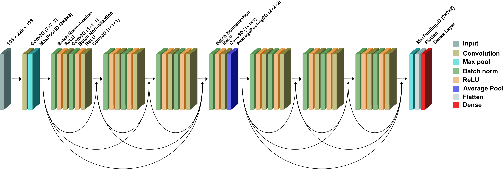

# **Hybrid Multimodal Late Fusion Frameworks for bvFTD Classification in Imbalanced Dementia Datasets**

**This repository contains the official implementation of our proposed method.**  
The corresponding manuscript is currently under review.

---

**Abstract**  
Behavioral variant frontotemporal dementia (bvFTD) is an irreversible neurodegenerative disorder characterized by progressive changes in personality and behavior. However, due to the low prevalence of bvFTD among neurodegenerative diseases causing the dementia syndrome, conventional machine learning approaches may struggle to capture comprehensive feature representations.  
Therefore, this study proposes two late fusion frameworks that integrate a 3D convolutional neural network and a multilayer perceptron (MLP) for improved bvFTD diagnosis.  

To address class imbalance, bvFTD data were initially augmented. A 3D DenseNet was used to extract features from 3D T1-weighted MRI scans, while a MLP was applied to regional brain volumetric measurements obtained from automated MRI-based brain segmentation. Both fusion strategies improved accuracy, F1-score, and AUC compared to the baseline model without data augmentation.

---

## **3D CNN Model Architecture**  
We chose to implement 3D-DenseNet Architecture for our study. See [src/models](src/models) for implementation details.  
Following image illustrates the DenseNet model architecture that was utilized in this study.

	

## **Key Findings**  
Following is the mean relevance map for the HC, AD and bvFTD groups obtained using the LRP relevance propagation method for the trained Densenet model. Coronal slices Y=[117,125,135] in MNI reference space are shown.

---

Our results demonstrate that data augmentation leads to improvements in accuracy, F1-score and AUC. We also see significant improvements not only in fully connected settings but also in ensemble-based models.

---

## **Citation**  
Citation information will be updated after publication.
